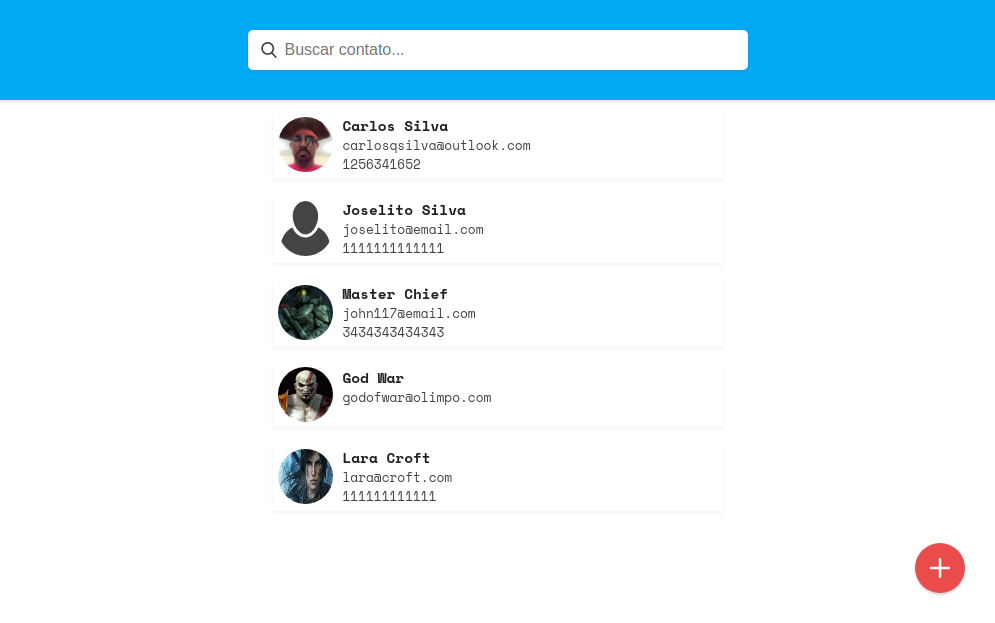
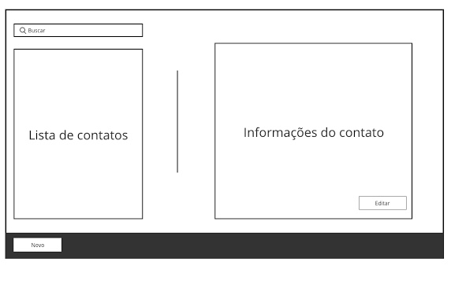

# Streamtel Front-End Test

* Demo: [clique aqui](https://carlosqsilva.github.io/Streamtel-FrontEnd-Test/)
* Meu Site: [carloseng.com](https://carloseng.com)

Criar um web app de uma agenda de contatos.

A agenda deve:

* [x] Buscar contatos (Nome ou e-mail);
* [x] Cadastrar novo contato;
* [x] Editar contato;
* [x] Excluir contato.
* [x] Utilize os seguintes wireframe como base.

### Requisitos

* [x] O app deve ser desenvolvido com ReactJs em ES6;
* [x] O contato deve possuir nome, sobrenome, email, telefone e endereço;
* [x] Não deve ser utilizado nenhum framework como Bootstrap para grid e estilo.

## Extras

* [x] Persista os contatos utilzando Local Storage ou IndexDB; (Utilizei [redux-persist](https://github.com/rt2zz/redux-persist) com [localForage](https://github.com/localForage/localForage))
* [ ] Utilizar algum pré-processador CSS como Sass ou Less; (Fiz uso de [styled-components](https://github.com/styled-components/styled-components))
* [x] Adicionar foto ao cadastro do contato.
* [x] Fazer com que seja responsivo.
